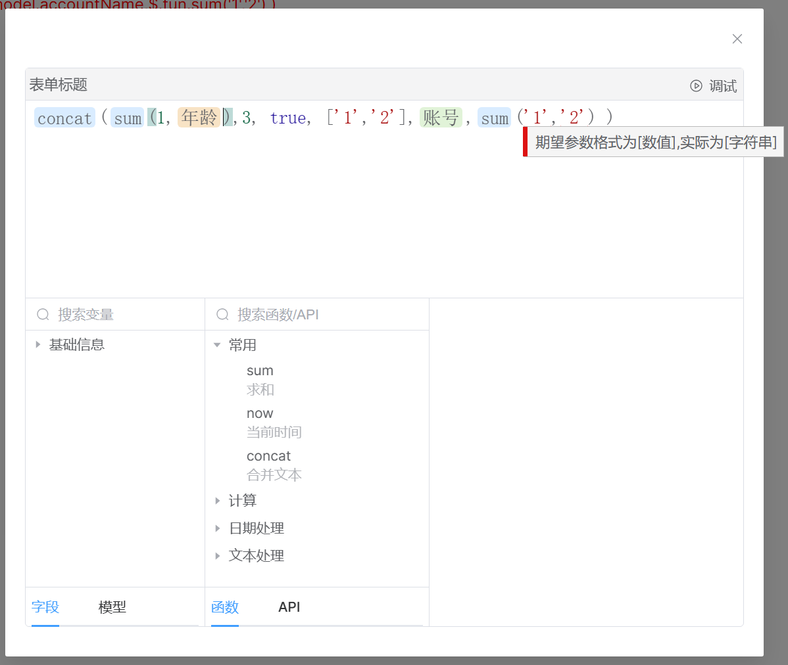
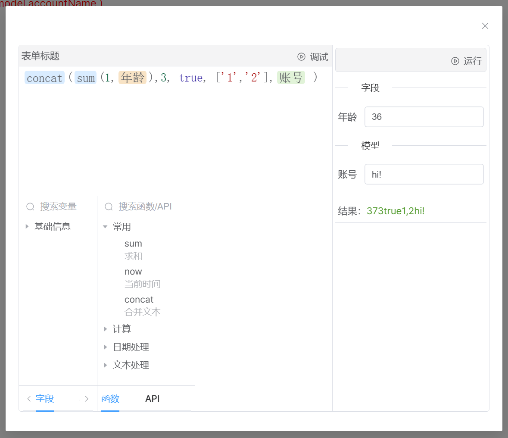
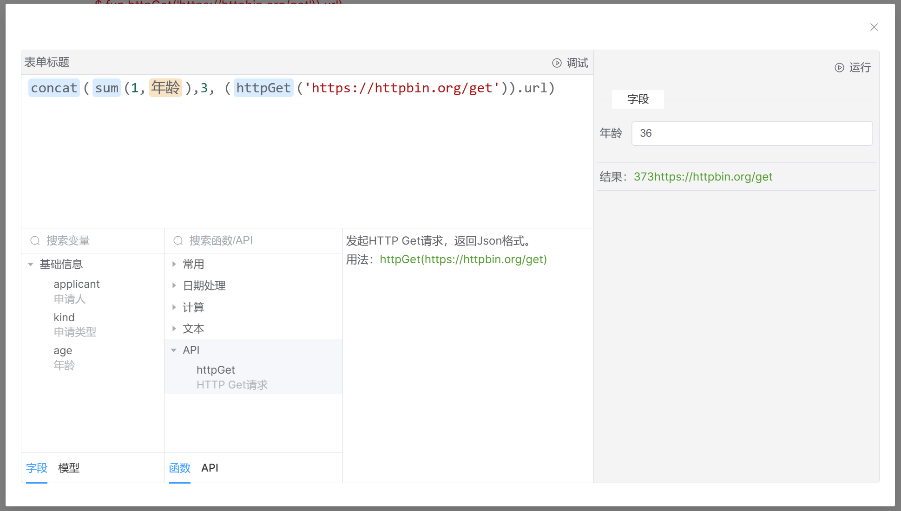
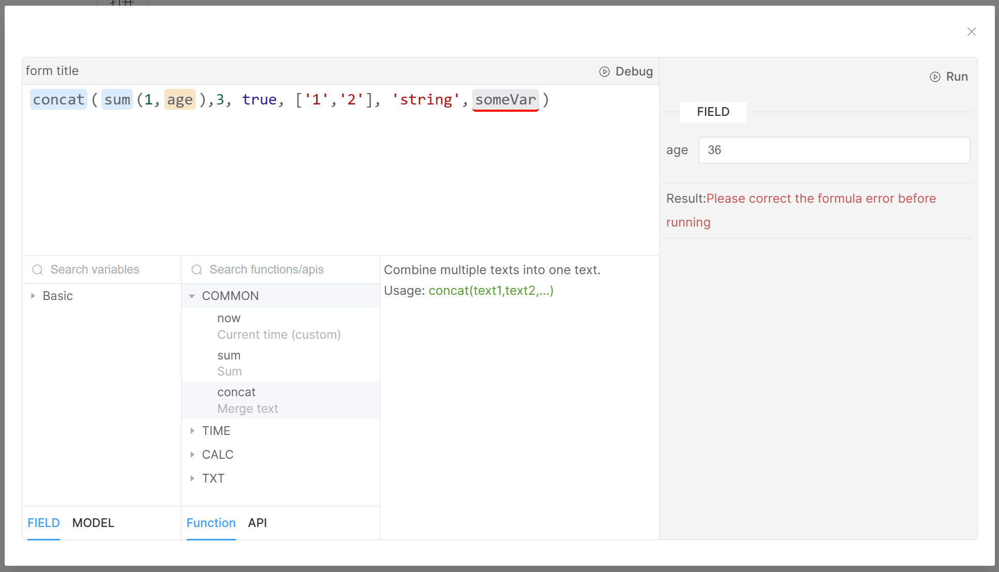

# Formula Editor

**A relatively complete formula editor.**

## Features

- Visual design
- Relatively comprehensive error prompts
- Auto-completion prompts
- Customizable variables and synchronous/asynchronous functions
- Online debugging
- Dynamic formula execution engine

## Screenshots

**Error diagnosis**

**Online debugging**

**Asynchronous call**

**I18n**

## Documentation and examples

[https://ideal-world.github.io/formula-editor/](https://ideal-world.github.io/formula-editor/)
