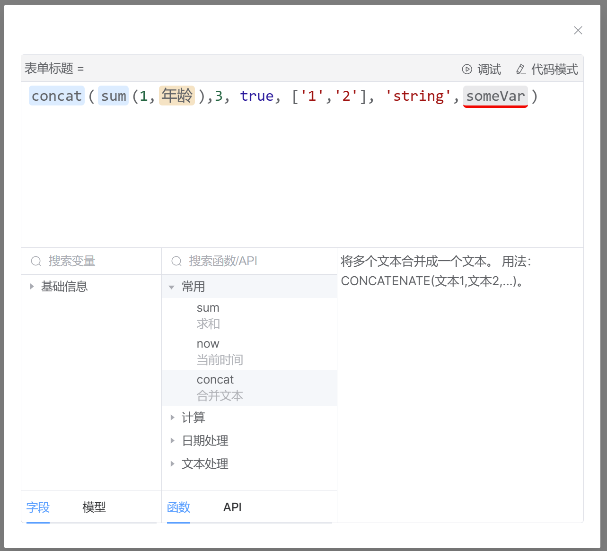

> Preview version, will not guarantee the stability of the API! Do NOT use in production environment!

# Formula Editor 

**A relatively complete formula editor.**

### https://ideal-world.github.io/formula-editor/

---
Project template from https://github.com/wuruoyun/vue-component-lib-starter
