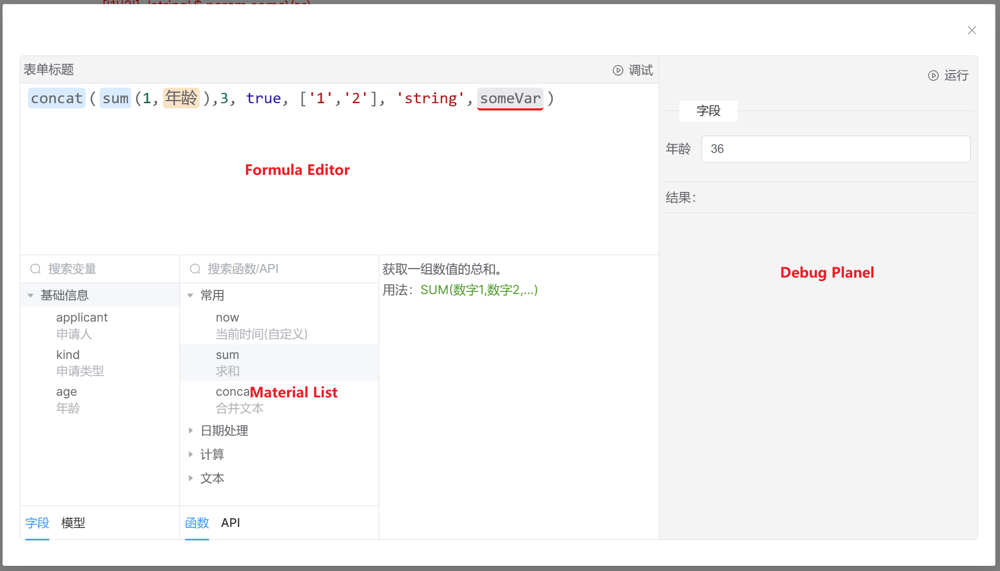

# Formula Editor

**A relatively complete formula editor.**

## Features

* Visual design
* Relatively comprehensive error prompts
* Auto-completion prompts
* Customizable variables and synchronous/asynchronous functions
* Online debugging
* Dynamic formula execution engine

## Design



The formulas generated by the online editor fully comply with js syntax.

In order to better display the formula, we abstract an object named ``material``. This object can be a ``variable`` or ``function``. Users can customize ``materials``. These ``materials'' will be displayed in the editor for easy viewing and use.

In order to enable the editor to render ``material`` correctly, we have limited its format. A ``material`` consists of ``entry variable + namespace + material name``. The default ``entry variable`` is ``$``. The following are legal material definitions:

* Age field ``$.field.age``
* Applicant field ``$.model.applicant`` in the model
* Addition function ``$.fun.sum``
* Get the current time function ``$.fun.now``
* Call xxAPI ``$.api.xx``

Therefore, a regular ``formula`` would be: ``$.fun.sum($.field.age, 3)`` .

During actual execution, the execution engine will convert ``material`` and ``formula`` into JS code, such as:

```js
let $={
    fun: {
        sum: function() {
            return Array.from(arguments).reduce((a, b) => a + b)
        }
    },
    field: {
        age: 18 // From default value or user input value
    }
}

const asyncFunction = Object.getPrototypeOf(async function () {
  }).constructor
    const asyncFn = new asyncFunction('$', `return ` + formulaValue)
    return await asyncFn($)
```

## Setup

This setup assumes your client app is created with Vite and vue-ts template.

In your `package.json`, you shall have the dependencies compatible with the following:

```json
"dependencies": {
  "@idealworld/formula-editor":"^1.0.0",
  "@element-plus/icons-vue": "^2.1.0",
  "element-plus": "^2.3.12",
  "vue": "^3.3.4"
}
```

In your `main.ts`, you shall import the libraries and CSS:

```ts
import {createApp} from 'vue'
import App from './App.vue'
import ElementPlus from 'element-plus'
import 'element-plus/dist/index.css'
import FormulaEditor from 'formula-editor';
import 'formula-editor/dist/style.css';

createApp(App)
    .use(ElementPlus)
    .use(FormulaEditor)

```

Import components from this library in your own component:

```html
<script setup lang="ts">
    import {iwInterface} from "formula-editor";

    const formulaValue = ref<string>(`$.fun.concat($.fun.sum(1,$.field.age),3, true, ['1','2'], 'string',$.param.someVar)`)
    const dialogVisible = ref<boolean>(false)

    const targetVar: iwInterface.VarInfo = {
        name: 'formName',
        label: '表单标题',
        kind: iwInterface.VarKind.STRING,
        note: '表单的显示名称',
        minLen: 2,
        maxLen: 20
    }

    const materials : iwInterface.Namespace[] = [
        {
            name: 'field',
            label: '字段',
            isVar: true,
            showLabel: true,
            color: '#f8e3c5',
            items: [
                {
                    name: 'applicant',
                    label: '申请人',
                    kind: iwInterface.VarKind.STRING,
                    note: '表单申请人姓名',
                    minLen: 2,
                    maxLen: 20,
                    cates: ['基础信息']
                }
            ]
        },
        {
            name: 'model',
            label: '模型',
            isVar: true,
            showLabel: true,
            color: '#e1f3d8',
            items: [
                {
                    name: 'accountName',
                    label: '账号',
                    kind: iwInterface.VarKind.STRING,
                    note: '账号名',
                    minLen: 2,
                    maxLen: 20,
                    cates: ['账户']
                },
                {
                    name: 'phone',
                    label: '手机号',
                    kind: iwInterface.VarKind.STRING,
                    cates: ['账户']
                },
            ]
        },
        {
            name: 'api',
            label: 'API',
            isVar: false,
            showLabel: true,
            color: '#d9ec00',
            items: [
                {
                    name: 'getUserInfo',
                    label: '获取用户基础信息',
                    note: `根据用户Id获取用户信息`,
                    input: [
                        {
                            label: '用户Id',
                            kind: iwInterface.VarKind.STRING
                        }
                    ],
                    isVarLen: false,
                    isAsync: true,
                    body: `return await (await fetch('http://x.x.x.x/user/'+arguments[0])).json()`
                    output: {
                        kind: iwInterface.VarKind.ANY
                    },
                    cates: ['用户']
                }
            ]
        }
    ]
</script>

<template>
    <el-button @click="dialogVisible = true">打开</el-button>
    <el-dialog v-model="dialogVisible">
        <iw-editor v-model:formulaValue="formulaValue" :targetVar="targetVar" :materials="materials"/>
    </el-dialog>
</template>
```
